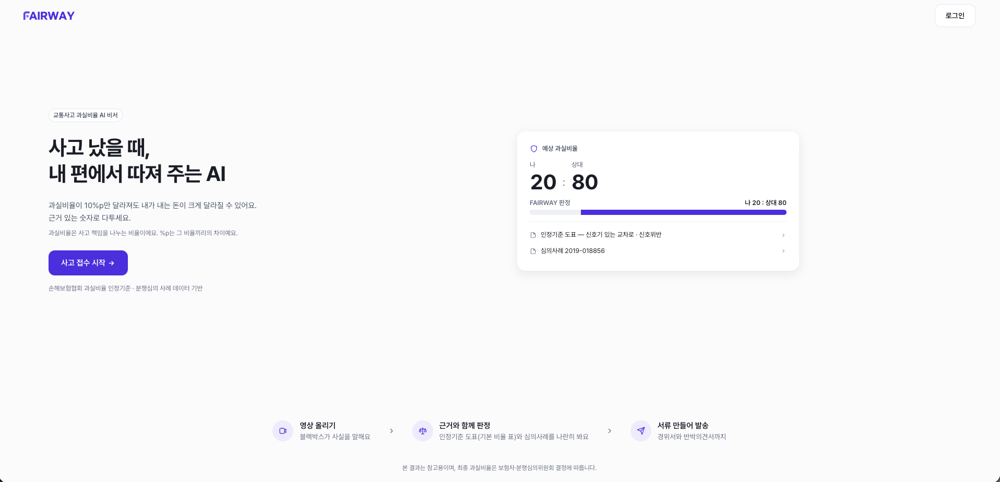
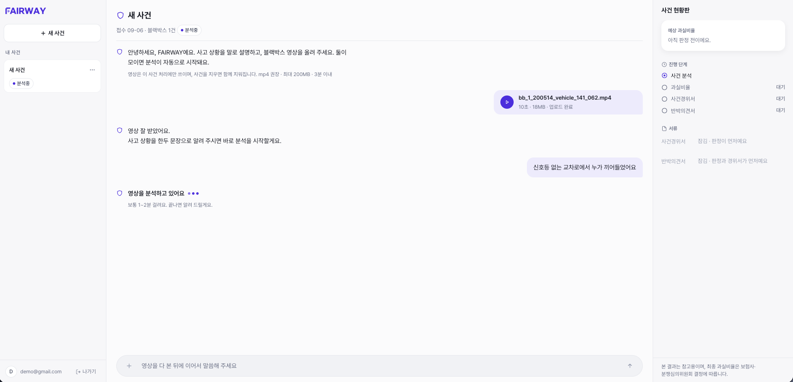
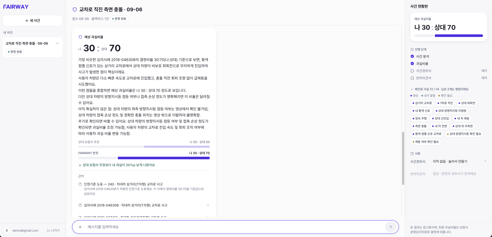
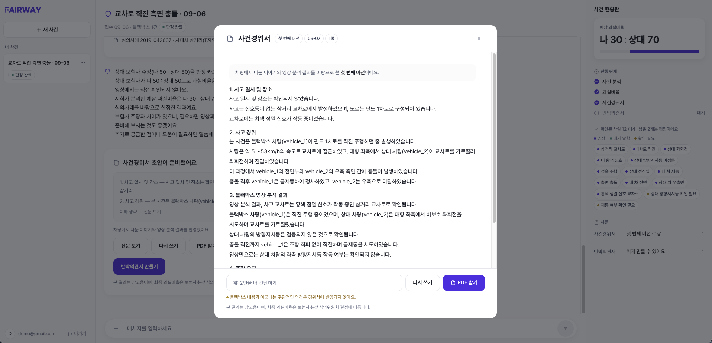
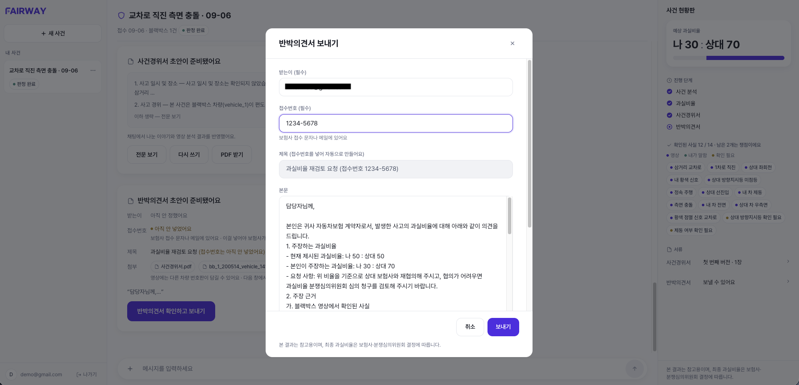

# FAIRWAY

> 사고 났을 때, 내 편에서 따져 주는 AI

블랙박스 영상으로 **교통사고 과실비율**을 근거와 함께 따져 주고,
보험사에 낼 **사건경위서·반박의견서**까지 만들어 보내 주는 채팅형 웹 서비스.

| | |
|---|---|
| **기간** | 2026.08.28 ~ 09.07 (10일) |
| **팀 구성** | 총 **4명** — 디자이너 1명 · 백엔드 개발자 1명 · AI 개발자 1명 · 프론트엔드 개발자 1명 |
| **역할** | 프론트엔드 **1인** — 설계 · 구현 · 목 서버 · 배포 |
| **협업** | 디자이너 · 백엔드 · AI 개발자와 함께한 금융 AI 챌린지 해커톤 출품작 |
| **스택** | React 19 · TypeScript · Vite 8 · Tailwind 4 · zustand · react-router 8 · SSE |
| **규모** | TS/TSX 94개 · 11,500줄 · 시안 61화면 → 라우트 5개 |

```bash
pnpm install && pnpm dev   # 백엔드 없이 전 구간이 돈다 (예시 영상 5개 포함)
```



<br>

## 문제

교통사고 과실비율은 보험사끼리 정해 통보한다. **10%p만 달라져도 내가 내는 돈과 다음 해 보험료가
크게 달라지는데**, 그 숫자의 근거를 알기 어렵고 이의를 제기할 서류도 혼자 쓰기 어렵다.

## 기능

| | 하는 일 |
|---|---|
| **영상 분석** | 블랙박스에서 신호·차선·속도·충돌 부위를 읽어 사실관계를 정리한다 |
| **과실비율 판정** | 손해보험협회 인정기준 도표로 기본 비율을 잡고, 뒤집힌 분쟁심의 사례를 근거로 붙인다 |
| **상대 주장 비교** | 상대 보험사가 주장한 비율을 판정과 나란히 막대로 견준다 |
| **사실·쟁점 현황판** | 영상에서 확정된 사실과 아직 못 밝힌 쟁점을 칩으로 세어 보여 준다 |
| **서류 자동 작성** | 사건경위서·반박의견서 초안을 만들고, 고칠 곳을 말하면 다시 쓴다 |
| **메일 발송** | 완성된 반박의견서를 영상과 함께 보험사에 보낸다 |

사용자는 사건 하나를 열고 **채팅 한 줄기 안에서** 접수부터 발송까지 간다.
사고 설명과 영상이 모이면 버튼 없이 분석이 시작되고, 모자란 정보는 AI가 되묻는다.

## 화면 흐름

<table>
<tr>
<td width="50%"><a href="docs/screenshots/06-analyzing.png"></a></td>
<td width="50%"><a href="docs/screenshots/07-verdict.png"></a></td>
</tr>
<tr>
<td><b>① 접수와 영상 분석</b><br>사고 설명과 블랙박스 영상이 모이면 버튼 없이 분석이 시작된다. 오른쪽 현황판이 진행 단계를 따라간다</td>
<td><b>② 과실비율 판정</b><br>비율 · 한 줄 결론 · 인정기준 도표 · 심의사례가 카드 한 장에. 상대 보험사 주장은 막대 두 줄로 견준다</td>
</tr>
<tr>
<td><a href="docs/screenshots/10-statement-full.png"></a></td>
<td><a href="docs/screenshots/12-rebuttal-send.png"></a></td>
</tr>
<tr>
<td><b>③ 사건경위서</b><br>대화와 영상 분석을 반영해 초안을 쓴다. "2번을 더 간단하게"처럼 말하면 다시 쓰고, PDF로 저장한다</td>
<td><b>④ 반박의견서 발송</b><br>받는이·접수번호를 채우면 제목이 자동으로 만들어지고, 경위서 PDF와 영상을 붙여 보험사에 보낸다</td>
</tr>
</table>

<details>
<summary>나머지 화면 — 로그인 · 가입 · 사건 목록 · 접수 안내 · 심의사례 · 초안 · 발송 완료</summary>

| | |
|---|---|
| [로그인](docs/screenshots/02-login.png) · [회원가입](docs/screenshots/03-signup.png) | 약관 동의 · 비밀번호 재설정까지 |
| [사건 목록](docs/screenshots/04-cases.png) | 상태 배지로 어디까지 갔는지 본다 |
| [접수 안내](docs/screenshots/05-intake.png) | 첫 사건을 열면 무엇을 올려야 하는지 안내한다 |
| [심의사례](docs/screenshots/08-precedent.png) | 판정 근거가 된 분쟁심의 사례 전문 |
| [경위서 초안](docs/screenshots/09-statement-draft.png) · [반박의견서 초안](docs/screenshots/11-rebuttal-draft.png) | 대화에 카드로 붙는다 |
| [발송 완료](docs/screenshots/13-rebuttal-sent.png) | 보낸 뒤 할 일까지 안내한다 |

</details>

라우트는 5개뿐이다 — `/` · `/login` · `/signup` · `/cases` · `/cases/:caseId`.
위 화면 대부분이 **마지막 하나** 안에서 일어난다.

<br>

## 아키텍처

```
                      ┌─ pages / features  화면은 도메인 타입만 안다
  화면 61장           │      ↕
  → 라우트 5개  ──────┤   store   caseStore · chatReducer(추가 전용 대화 로그) · sessionStore
                      │      ↕
                      └─ api/service.ts ── 계약 ──┬── http/  fetch · XHR · SSE · DTO↔도메인 매핑
                                                  └── mock/  같은 계약의 브라우저 구현
                                                       교체 지점: api/index.ts 한 줄
```

```
src/
  domain/         타입 정본 — Case · Verdict · Statement · Rebuttal · ChatMessage(10종)
  api/            service.ts(계약) · http/(client · sse · map · endpoints) · mock/
  store/          caseStore · chatReducer · sessionStore
  pages/          라우트 5장 + DesignSystemPage(개발 전용)
  features/       auth · cases · onboarding · workspace(messages/ dialogs/) · documents
  components/ui/  Button Badge RatioBar Dialog Drawer Field Icon(26종) Disclaimer …
  styles/theme.css  색·간격·반경·초점 토큰 정본
  config.ts       미확정 값 전부 (APP_NAME · VIDEO_LIMITS · EMAIL_MODE …)
dev/              개발 서버 목 API — 앱 번들에 들어가지 않는다
```

<br>

## 실행

```bash
pnpm dev         # 목 모드. 백엔드 없이 전 구간이 돈다
pnpm dev:api     # 개발 서버 + 목 백엔드(진짜 HTTP). 네트워크 탭에 다 찍힌다
pnpm build       # tsc -b && vite build
pnpm lint        # oxlint
```

패키지 매니저는 **pnpm**, Node 22. 목 모드에서는 계정 검사가 없어 아무 이메일·8자 비밀번호로 들어간다.

백엔드에 붙이려면 `.env.local`에 둘 다 넣는다 — 하나라도 빠지면 **아무 소리 없이 목으로 떨어진다.**

```bash
VITE_API=http
VITE_API_BASE=/api/v1              # 배포에는 https://<api 주소>/api/v1
DEV_API_PROXY=https://<api 주소>    # 개발 서버가 중계할 곳 (같은 출처여야 refresh 쿠키가 따라온다)
```
